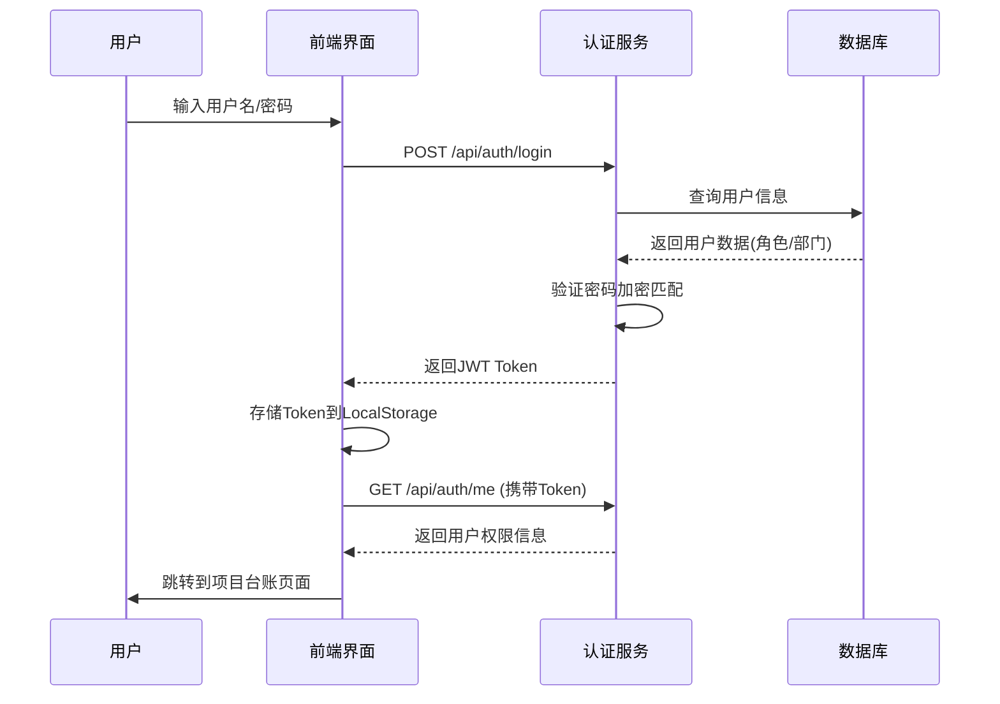
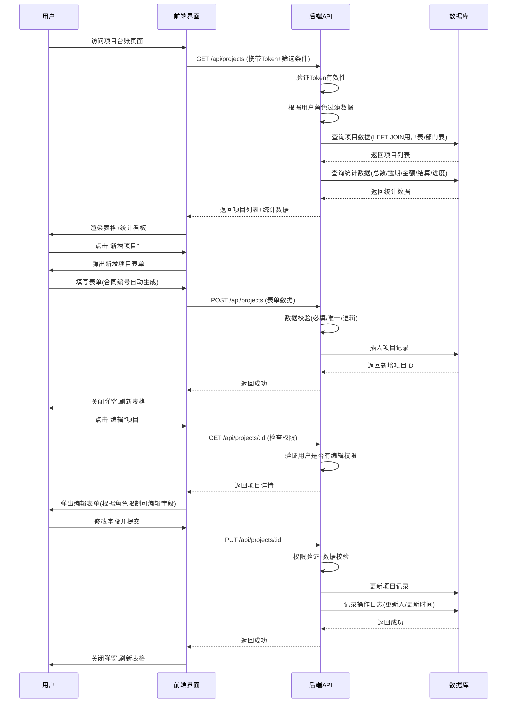
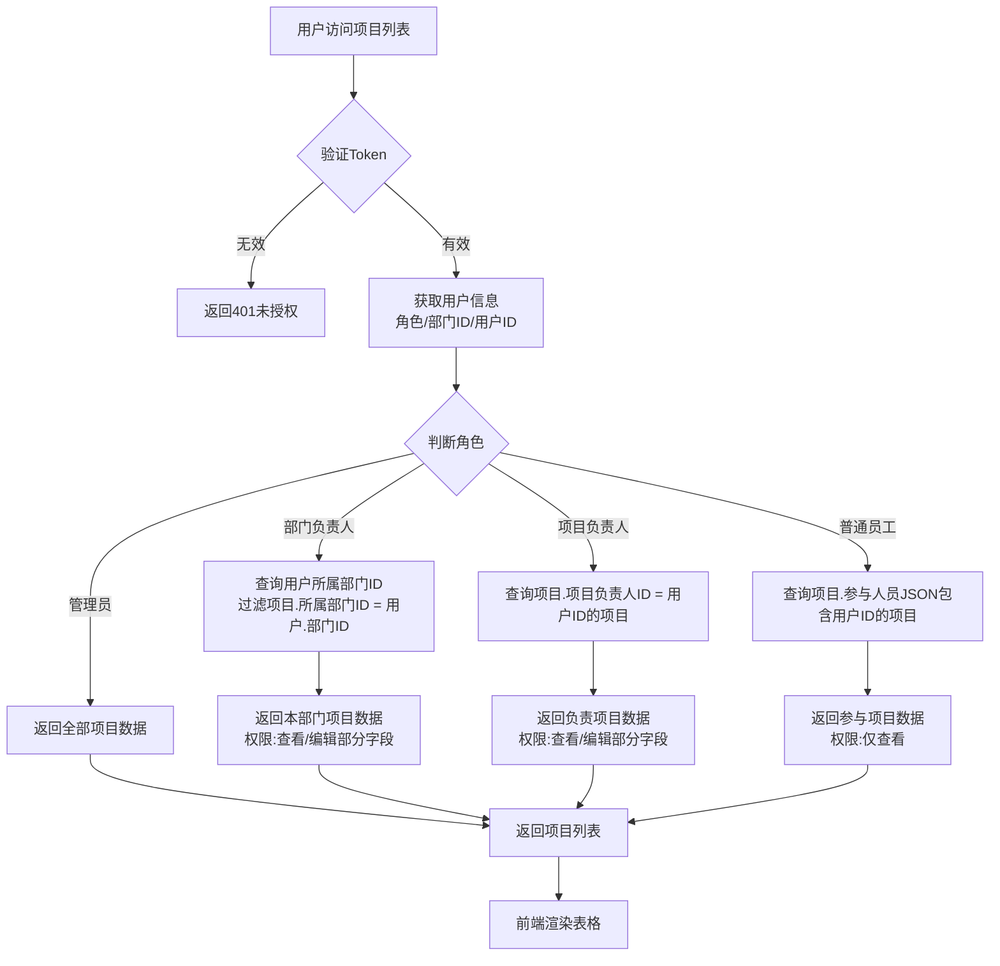
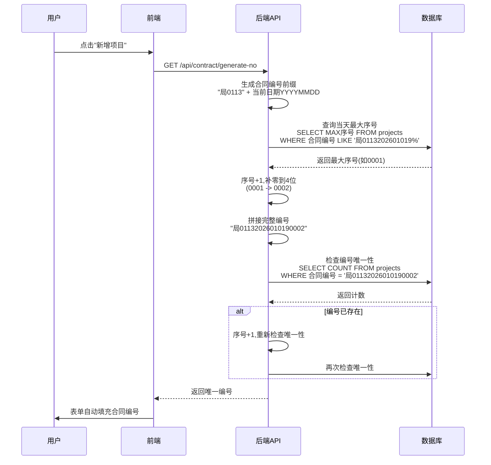

# BIM项目管理系统 - 项目台账管理模块 PRD

## 📋 文档信息

| 项目 | 内容 |
|------|------|
| 产品名称 | BIM项目管理系统 - 项目台账管理模块 |
| 版本 | V1.0 MVP |
| 创建日期 | 2026-01-09 |
| 最后更新 | 2026-01-09 |
| 文档状态 | ✅ 已确认 |
| 设计师 | Claude (首席产品设计师) |

---

## 🎯 核心目标 (Mission)

打造一个极简、专业、高效的BIM项目台账管理系统，实现项目全生命周期的数字化管理，帮助企业提升项目管理效率，让项目信息透明化、可追溯、易管理。

---

## 👥 用户画像 (Persona)

### 主要用户群体

#### 1. 企业管理层
- **核心诉求**：实时掌握项目整体情况（逾期项目、回款情况、结算进度）
- **使用场景**：每天查看统计看板，关注逾期项目和回款金额
- **痛点**：项目信息分散，无法快速获取决策数据

#### 2. 部门负责人
- **核心诉求**：管理本部门所有项目，跟踪项目进度和结算情况
- **使用场景**：每周查看部门项目列表，更新项目进度和结算状态
- **痛点**：无法快速筛选本部门项目，手动统计效率低

#### 3. 项目负责人
- **核心诉求**：更新自己负责项目的进度，管理项目参与人员
- **使用场景**：每天更新项目进度，添加/移除参与人员
- **痛点**：Excel文件版本混乱，无法追溯修改历史

#### 4. 项目参与人员
- **核心诉求**：查看自己参与的项目信息
- **使用场景**：偶尔查看项目详情，了解项目进度
- **痛点**：无法及时获取项目最新信息

### 核心痛点总结

1. **项目信息分散**：项目信息散落在Excel表格、微信群、纸质文档中，难以统一管理
2. **进度跟踪困难**：无法实时掌握项目进度，逾期项目难以发现
3. **权限管理混乱**：不同角色的人员权限不清晰，数据安全性无法保证
4. **数据统计低效**：需要手动统计项目总数、逾期项目数、回款金额等数据，耗时且易出错
5. **历史追溯困难**：无法追溯项目信息的修改历史，责任不明确

---

## 🚀 V1: 最小可行产品 (MVP)

### 核心功能列表

#### 1. 基础信息管理

**新增项目**
- 弹窗表单录入，支持5个必填字段：
  - 合同编号（自动生成，格式：局0113 + 日期YYYYMMDD + 序号4位）
  - 合同名称
  - 起止日期
  - 合同金额（万元，保留2位小数）
  - 项目负责人
- 支持8个选填字段：
  - 项目进度（0-100%，默认0%）
  - 结算情况（未结算/部分结算/结算完成）
  - 参与人员（多选用户，JSON数组存储）
  - 是否签订（已签订/未签订）
  - 回款金额（万元，默认0）
  - 所属部门（枚举值）
  - 项目类型（枚举值）
  - 项目备注（多行文本，最多500字）

**编辑项目**
- 根据角色权限，支持编辑部分字段或全部字段
- 编辑记录：更新人ID、更新时间自动记录

**删除项目**
- 仅管理员可删除
- 删除前二次确认弹窗："删除后数据不可恢复，是否确认删除？"

**查看详情**
- 点击项目名称或"查看详情"按钮，弹窗显示完整项目信息（13个字段）
- 包含创建人、创建时间、最后修改人、最后修改时间

#### 2. 表格视图（方案A：极简专业风）

**默认显示10个核心字段**
1. 合同编号
2. 合同名称
3. 起止日期（开始-结束）
4. 合同金额
5. 项目进度（进度条，颜色随进度变化）
6. 项目负责人
7. 结算情况
8. 是否签订（✅已签订 / ❌未签订）
9. 回款金额
10. 操作（编辑/查看详情）

**字段自定义显示**
- 右上角"列设置"图标（⚙️），点击后下拉显示字段勾选列表
- 13个字段可选（10个核心字段 + 参与人员 + 所属部门 + 项目类型）
- 用户偏好保存到数据库，下次登录时恢复

**分页显示**
- 支持10/20/50/100条/页，默认20条/页
- 分页控件：首页、上一页、下一页、末页、页码跳转
- 显示"共X条，第X/X页"

**表头排序**
- 点击表头字段实现升序/降序排序
- 排序字段标注排序图标（↑/↓）

**固定表头**
- 滚动时表头保持不动，方便对照数据

**行hover效果**
- hover行时背景色变为浅蓝色（#eef5ff）
- 显示"编辑/查看详情"按钮（图标化）

#### 3. 筛选与检索

**精准搜索**
- 顶部搜索框，宽度300px
- 支持按"合同编号、合同名称、项目负责人、参与人员"模糊搜索
- 搜索延迟300ms，避免频繁触发

**下拉筛选**
- 3个筛选条件：
  1. 结算状态（全部/未结算/部分结算/结算完成）
  2. 项目负责人（下拉选择用户列表）
  3. 是否逾期（全部/是/否）
- 筛选条件可组合使用

**筛选记忆**
- 系统自动记忆用户上次使用的筛选条件（当前登录会话有效）

#### 4. 数据统计与可视化

**顶部统计看板**
- 5个统计卡片，固定显示，不随滚动隐藏：
  1. 项目总数（所有项目数量）
  2. 逾期项目数（边框红色高亮）
  3. 总合同金额（所有项目合同金额总和，万元）
  4. 已结算项目数/占比（已完成结算的项目数量及占比）
  5. 平均项目进度（所有项目进度的平均值，百分比）

**进度可视化**
- 进度条颜色随进度变化：
  - 0-30%：红色（进度滞后）
  - 30%-70%：黄色（进度正常）
  - 70%-100%：绿色（进度良好）
- 进度条样式：圆角6px，高度6px

**逾期项目标注**
- 逾期项目判断：当前日期 > 结束日期 且 项目进度 < 100%
- 表格中逾期项目行背景色浅红色

#### 5. 权限管理（四级权限体系）

**管理员**
- 全部操作权限（录入/编辑/删除/筛选/导出/权限配置）
- 可编辑所有字段

**部门负责人**
- 可查看/编辑/导出本部门项目
- 可编辑字段：项目进度、结算情况、参与人员、是否签订、回款金额、项目备注
- 不可编辑字段：合同编号、合同名称、起止日期、合同金额、项目负责人
- 无删除权限

**项目负责人**
- 可查看/编辑自己负责的项目（项目负责人ID = 当前用户ID）
- 可编辑字段：项目进度、参与人员、项目备注
- 不可编辑字段：合同编号、合同名称、起止日期、合同金额、项目负责人、结算情况、是否签订、回款金额、所属部门、项目类型
- 无删除权限

**普通员工**
- 只能查看自己参与的项目（参与人员JSON包含当前用户ID）
- 无编辑/删除权限

**权限控制**
- 无权限操作的按钮灰化显示
- 悬浮提示："您无此操作权限，请联系管理员"

#### 6. 数据导出

**Excel导出**
- 导出当前筛选结果的全部数据
- 导出所有字段（不受表格显示配置影响）
- 文件命名规则："项目台账_导出时间_操作人.xlsx"
- 例如："项目台账_20260109_张三.xlsx"

#### 7. UI/UX设计（极简专业风）

**设计风格**
- 极简主义 + 专业科技感
- 主色调：深空蓝（#1e3a8a）
- 中性色：浅灰（#f5f7fa）、白色（#ffffff）
- 功能警示色：绿色（进度正常）、黄色（进度预警）、红色（逾期/异常）
- 色彩饱和度控制在70%-80%

**系统级页面布局（尼尔森F型视觉模型）**

**侧导航栏**
- 位置：页面左侧固定，宽度220px，高度100%
- 背景色：纯白色
- 边框：右侧1px浅灰色分隔线（#e0e0e0）
- 内容构成：
  - 顶部：系统Logo + 系统名称"BIM项目管理系统"
  - 中间：导航菜单（项目台账管理、工作台、工作分解、周报管理等）
  - 当前激活模块：主题色左侧竖线 + 文字变色
  - 底部：用户信息入口（头像 + 用户名）
- 交互细节：
  - 支持折叠/展开（220px ↔ 60px）
  - hover时背景色变为浅灰色（#f8f9fa）

**顶部导航**
- 位置：侧导航栏右侧，宽度=浏览器窗口宽度-侧导航栏宽度，高度60px
- 背景色：纯白色
- 边框：底部1px浅灰色分隔线（#e0e0e0）
- 固定显示（滚动时不跟随滚动）
- 内容构成：
  - 左侧：面包屑导航（首页 > 项目管理 > 项目台账管理）
  - 中间：系统级功能入口（消息通知🔔、系统设置⚙️）
  - 右侧：功能按钮组（视图切换、高级筛选、导出、新增项目）
- 交互细节：
  - 按钮 hover 时轻微变色 + 阴影效果（0 2px 8px rgba(0,0,0,0.1)）
  - "新增项目"按钮：主题色背景 + 白色文字，突出重要操作

**内容区域**
- 位置：顶部导航下方
- 背景色：浅灰色（#f5f7fa）
- 支持滚动

**搜索与统计区**
- 搜索框：宽度300px，圆角8px，聚焦时边框变色为主题色
- 统计看板：5个统计卡片横向排列，每个卡片圆角12px，轻微阴影

**表格视图**
- 无边框设计
- 行间距16px
- 表头背景色：浅灰色（#f8f9fa），字体加粗14px
- 数据行字体13px
- hover行时背景色为极浅的主题色（#eef5ff）
- 进度条：圆角设计，高度6px
- 操作按钮：默认隐藏，hover行时显示，图标化
- 表格外框与内容区域边界保留24px内边距

**分页控件**
- 内容区域底部居中显示
- 包含页码切换、每页条数选择、当前数据量提示
- 分页按钮扁平化设计，当前页码高亮显示（主题色背景 + 白色文字）
- 分页控件与视图内容区保留24px间距

**交互动效**
- hover效果：所有可点击元素hover时均有明显反馈（颜色变化、阴影加深、轻微放大）
- 弹窗动画：淡入动画200ms
- 加载状态：骨架屏（表格视图显示表头 + 行骨架）
- 侧导航栏折叠/展开：平滑过渡动画300ms

**图标与字体**
- 图标：线性图标，线条粗细2px，颜色与文字一致
- 字体：无衬线字体（微软雅黑、思源黑体）
- 字体层级：
  - 模块标题：18px，加粗
  - 弹窗标题：16px，加粗
  - 统计数值：20px，加粗
  - 字段值：13px
  - 字段名称/提示文字：12px，灰色

**响应式设计**
- 支持PC端（最小宽度1280px）
- MVP阶段不支持平板端和移动端（V3版本支持）

---

## 📅 V2 及以后版本 (Future Releases)

### V2: 高级功能
- ⏰ **批量操作**：批量编辑、批量删除、批量导入（Excel模板导入）
- ⏰ **高级筛选**：时间范围筛选、金额范围筛选、进度范围筛选
- ⏰ **打印功能**：打印预览、自定义打印设置
- ⏰ **卡片视图**：卡片式视图展示项目信息
- ⏰ **操作日志**：记录项目信息的修改历史（操作人、操作时间、修改内容）
- ⏰ **枚举值自定义**：用户可以在系统设置中自定义添加项目类型、所属部门等枚举值
- ⏰ **回款记录明细**：新建"回款记录"表，记录每次回款的金额、时间、回款人

### V3: 移动端与数据可视化
- ⏰ **移动端适配**：平板端（768px-1279px）、移动端（<768px）自适应布局
- ⏰ **数据可视化大屏**：项目数据可视化图表（饼图、柱状图、折线图）
- ⏰ **项目归档功能**：支持项目归档，归档后不显示在列表中，可在"已归档"模块查看

### V4: 智能化与集成
- ⏰ **智能预警**：项目逾期前7天自动发送邮件/短信提醒
- ⏰ **数据自动备份**：每日凌晨自动备份，支持数据恢复
- ⏰ **与其他模块集成**：工作台、工作分解、周报管理等模块对接
- ⏰ **API接口**：提供RESTful API接口，支持第三方系统集成

---

## 📐 关键业务逻辑 (Business Rules)

### 1. 合同编号生成规则

**格式**
```
局 + 0113 + 日期(YYYYMMDD) + 序号(4位，累加不重置)
```

**示例**
```
局0113202601019001
局0113202601019002
局0113202601019003
...
```

**唯一性保证**
1. 应用层：生成编号后查询数据库，如果编号已存在则序号+1重新生成
2. 数据库层：为"合同编号"字段添加UNIQUE索引，重复插入时失败并提示

**生成流程**
1. 拼接前缀："局0113" + 当前日期YYYYMMDD
2. 查询当天最大序号：`SELECT MAX(序号) FROM projects WHERE 合同编号 LIKE '局0113202601019%'`
3. 序号+1，补零到4位（如：0001 -> 0002）
4. 拼接完整编号："局01132026010190002"
5. 检查唯一性：`SELECT COUNT FROM projects WHERE 合同编号 = '局01132026010190002'`
6. 如果编号已存在，序号+1，重新检查唯一性
7. 返回唯一编号

### 2. 项目进度规则

**范围**
- 0%-100%

**进度条颜色**
- 0-30%：红色（#ef4444，进度滞后）
- 30%-70%：黄色（#f59e0b，进度正常）
- 70%-100%：绿色（#10b981，进度良好）

**逾期判断**
- 当前日期 > 结束日期 且 项目进度 < 100%

### 3. 结算状态规则

**状态枚举**
- 未结算
- 部分结算
- 结算完成

**状态转换**
- 未结算 → 部分结算 → 结算完成
- 不可回退

### 4. 权限判断规则

**部门负责人**
- 通过"所属部门ID"判断
- 可以查看/编辑"所属部门ID"与用户"所属部门ID"相同的项目

**项目负责人**
- 通过"项目负责人ID"判断
- 可以查看/编辑"项目负责人ID = 当前用户ID"的项目

**普通员工**
- 通过"参与人员"字段（JSON数组）判断
- 可以查看参与人员包含当前用户ID的项目
- SQL查询：`WHERE JSON_CONTAINS(participants, '"当前用户ID"')`

### 5. 数据校验规则

**必填字段**
- 合同编号（自动生成）
- 合同名称
- 起止日期
- 合同金额
- 项目负责人

**唯一性校验**
- 合同编号唯一

**逻辑校验**
- 结束日期 > 开始日期
- 合同金额 > 0
- 回款金额 ≤ 合同金额
- 项目进度 0%-100%

**错误提示**
- 字段校验错误：红色文字 + 图标，置于错误字段下方
- 操作失败：顶部浮动弹窗，3秒后自动消失

---

## 📊 数据契约 (Data Contract)

### 1. 核心数据表

#### 用户表 (users)

| 字段名 | 类型 | 说明 | 是否必填 | 默认值 |
|--------|------|------|----------|--------|
| user_id | INT | 用户ID（主键，自增） | 是 | AUTO_INCREMENT |
| username | VARCHAR(50) | 用户名（唯一） | 是 | - |
| password | VARCHAR(255) | 密码（bcrypt加密） | 是 | - |
| full_name | VARCHAR(50) | 姓名 | 是 | - |
| avatar | VARCHAR(255) | 头像URL | 否 | NULL |
| dept_id | INT | 所属部门ID（外键） | 是 | - |
| role | ENUM | 角色（admin/dept_manager/project_manager/employee） | 是 | - |
| created_at | DATETIME | 创建时间 | 是 | CURRENT_TIMESTAMP |
| updated_at | DATETIME | 最后修改时间 | 是 | CURRENT_TIMESTAMP ON UPDATE |

**索引**
- PRIMARY KEY (user_id)
- UNIQUE KEY (username)
- INDEX (dept_id)
- INDEX (role)

#### 部门表 (departments)

| 字段名 | 类型 | 说明 | 是否必填 | 默认值 |
|--------|------|------|----------|--------|
| dept_id | INT | 部门ID（主键，自增） | 是 | AUTO_INCREMENT |
| dept_name | VARCHAR(50) | 部门名称 | 是 | - |
| dept_code | VARCHAR(10) | 部门缩写 | 是 | - |
| created_at | DATETIME | 创建时间 | 是 | CURRENT_TIMESTAMP |
| updated_at | DATETIME | 最后修改时间 | 是 | CURRENT_TIMESTAMP ON UPDATE |

**索引**
- PRIMARY KEY (dept_id)
- UNIQUE KEY (dept_code)

#### 项目表 (projects)

| 字段名 | 类型 | 说明 | 是否必填 | 默认值 |
|--------|------|------|----------|--------|
| project_id | INT | 项目ID（主键，自增） | 是 | AUTO_INCREMENT |
| contract_no | VARCHAR(50) | 合同编号（唯一） | 是 | - |
| contract_name | VARCHAR(100) | 合同名称 | 是 | - |
| start_date | DATE | 开始日期 | 是 | - |
| end_date | DATE | 结束日期 | 是 | - |
| contract_amount | DECIMAL(15,2) | 合同金额（万元） | 是 | - |
| progress | INT | 项目进度（0-100） | 是 | 0 |
| leader_id | INT | 项目负责人ID（外键） | 是 | - |
| settlement_status | ENUM | 结算状态（未结算/部分结算/结算完成） | 是 | 未结算 |
| participants | JSON | 参与人员ID数组（如[1,2,3]） | 否 | NULL |
| is_signed | ENUM | 是否签订（已签订/未签订） | 是 | 未签订 |
| payment_amount | DECIMAL(15,2) | 回款金额（万元） | 是 | 0.00 |
| dept_id | INT | 所属部门ID（外键） | 是 | - |
| project_type | ENUM | 项目类型 | 是 | - |
| remark | TEXT | 项目备注（最多500字） | 否 | NULL |
| created_by | INT | 创建人ID（外键） | 是 | - |
| created_at | DATETIME | 创建时间 | 是 | CURRENT_TIMESTAMP |
| updated_by | INT | 最后修改人ID（外键） | 否 | NULL |
| updated_at | DATETIME | 最后修改时间 | 是 | CURRENT_TIMESTAMP ON UPDATE |

**索引**
- PRIMARY KEY (project_id)
- UNIQUE KEY (contract_no)
- INDEX (leader_id)
- INDEX (dept_id)
- INDEX (settlement_status)
- INDEX (start_date, end_date)
- INDEX (participants) (生成列索引)

#### 用户偏好设置表 (user_preferences)

| 字段名 | 类型 | 说明 | 是否必填 | 默认值 |
|--------|------|------|----------|--------|
| preference_id | INT | 偏好设置ID（主键，自增） | 是 | AUTO_INCREMENT |
| user_id | INT | 用户ID（外键） | 是 | - |
| module_name | VARCHAR(50) | 模块标识（project_ledger） | 是 | - |
| field_config | JSON | 字段显示配置 | 是 | - |
| created_at | DATETIME | 创建时间 | 是 | CURRENT_TIMESTAMP |
| updated_at | DATETIME | 最后修改时间 | 是 | CURRENT_TIMESTAMP ON UPDATE |

**索引**
- PRIMARY KEY (preference_id)
- UNIQUE KEY (user_id, module_name)

### 2. 枚举值定义

#### 角色类型 (role)
- `admin`：管理员
- `dept_manager`：部门负责人
- `project_manager`：项目负责人
- `employee`：普通员工

#### 结算状态 (settlement_status)
- `未结算`
- `部分结算`
- `结算完成`

#### 是否签订 (is_signed)
- `已签订`
- `未签订`

#### 项目类型 (project_type) - MVP固定
- `建筑施工`
- `室内设计`
- `园林景观`
- `市政工程`
- `其他`

#### 所属部门 (departments) - MVP固定
- 部门ID 1：`项目部`
- 部门ID 2：`技术部`
- 部门ID 3：`财务部`
- 部门ID 4：`工程部`
- 部门ID 5：`综合部`

---

## 🎨 MVP 原型设计（方案A：极简专业风）

```
┌─────────────────────────────────────────────────────────────────────────────────────┐
│  BIM项目管理系统                            🔔  ⚙️            👤 管理员 ▼           │
├────────┬─────────────────────────────────────────────────────────────────────────────┤
│        │  首页 > 项目管理 > 项目台账管理                                              │
│        ├─────────────────────────────────────────────────────────────────────────────┤
│ 📊    │  🔍 搜索合同编号/名称/负责人...           📊 项目总数    🔴 逾期项目数        │
│ 项目   │                                         💰 总合同金额  ✅ 已结算项目数        │
│ 台账   │  筛选: [结算状态▼] [项目负责人▼]       📈 平均项目进度                      │
│ ✛     │                                         ────────────────────────────────────  │
│ 📋    │  [视图切换: ▦ ] [高级筛选] [导出] [新增项目]                                  │
│ 工作台 │  ─────────────────────────────────────────────────────────────────────────  │
│ 工作   │  合同编号      │ 合同名称    │ 起止日期   │ 金额   │ 进度 │负责人│结算│签订│操作│
│ 分解   │  ────────────────────────────────────────────────────────────────────────────│
│ 周报   │  局0113...001 │ XX大厦项目  │ 2026-01-01│ 120.50 │ ████████ 85% │张三│已结算│✅│ ✏️👁️│
│ 系统   │  局0113...002 │ YY花园项目  │ 2026-02-15 │  89.00 │ ██████ 65%   │李四│部分结算│❌│ ✏️👁️│
│ 设置   │  局0113...003 │ ZZ广场项目  │ 2026-03-10 │ 256.80 │ ████ 45%     │王五│未结算 │✅ │ ✏️👁️│
│        │  ────────────────────────────────────────────────────────────────────────────│
│        │  共 125 条                                      < 1 2 3 4 5 ... 13 >       │
└────────┴─────────────────────────────────────────────────────────────────────────────┘
```

### 设计理念
- **极致数据密度**：表格视图最大化显示数据，减少留白
- **操作效率优先**：所有操作一触即达，减少点击层级
- **专业工具感**：深色表头 + 细腻分割线，类似Excel的专业感
- **进度条内嵌**：进度条直接嵌入表格，视觉直观
- **状态图标化**：签订状态用✅/❌图标，一目了然

### 交互细节
1. **hover效果**：hover行时背景色变为浅蓝色（#eef5ff），显示"编辑/查看详情"按钮
2. **进度条可拖动**：鼠标hover进度条时，显示"拖动调整进度"提示，拖动后自动保存
3. **弹窗动画**：新增/编辑项目弹窗淡入动画200ms
4. **骨架屏加载**：数据加载时显示骨架屏，替代传统加载动画
5. **列设置下拉**：点击右上角"列设置"图标，下拉显示字段勾选列表，勾选后实时更新表格列

---

## 🏗️ 架构设计蓝图

### 核心流程图

#### 1. 用户登录与权限验证流程



#### 2. 项目台账主流程



#### 3. 权限判断流程



#### 4. 合同编号生成流程



### 组件交互说明

#### 前端文件结构
```
src/
├── pages/
│   └── ProjectLedger/
│       ├── index.tsx                 # 项目台账主页面
│       ├── components/
│       │   ├── StatsCards.tsx        # 统计看板组件
│       │   ├── ProjectTable.tsx      # 项目表格组件
│       │   ├── SearchBar.tsx         # 搜索栏组件
│       │   ├── FilterDropdown.tsx    # 筛选下拉组件
│       │   ├── ColumnSettings.tsx    # 列设置组件
│       │   ├── ProjectForm.tsx       # 新增/编辑项目表单
│       │   └── ProjectDetail.tsx     # 项目详情弹窗
│       └── hooks/
│           ├── useProjectData.ts     # 项目数据Hook
│           ├── useProjectStats.ts    # 统计数据Hook
│           └── usePermissions.ts     # 权限判断Hook
├── api/
│   └── projectLedger.ts              # 项目台账API接口
├── types/
│   └── projectLedger.ts              # TypeScript类型定义
└── utils/
    └── contractNoGenerator.ts        # 合同编号生成工具
```

#### 后端API接口
```
GET    /api/projects                    # 获取项目列表(支持筛选/分页/排序)
POST   /api/projects                    # 新增项目
GET    /api/projects/:id                # 获取项目详情
PUT    /api/projects/:id                # 更新项目
DELETE /api/projects/:id                # 删除项目
GET    /api/projects/export             # 导出Excel
GET    /api/projects/stats              # 获取统计数据
GET    /api/contract/generate-no        # 生成合同编号
GET    /api/user/preferences            # 获取用户偏好设置
POST   /api/user/preferences            # 保存用户偏好设置
```

### 技术选型

#### 前端技术栈
- React 18 + TypeScript
- Ant Design 5 (UI组件库)
- React Query (服务端状态管理)
- Zustand (客户端状态管理)
- React Router 6 (路由)
- Axios (HTTP客户端)
- CSS Modules + Tailwind CSS (样式)

#### 后端技术栈
- Node.js + Express + TypeScript
- MySQL 8.0 (数据库)
- Prisma (ORM)
- JWT (认证)
- bcrypt (密码加密)
- Zod (参数验证)
- exceljs (Excel导出)
- Winston (日志)

### 潜在技术风险与缓解方案

#### 风险1: JSON字段存储参与人员
- **风险**: JSON字段查询性能较差
- **缓解**: 为参与人员字段添加生成列+索引，MVP阶段项目数量少，性能影响可接受

#### 风险2: 合同编号唯一性保证
- **风险**: 并发创建项目时可能生成重复编号
- **缓解**: 使用数据库事务+行锁，或使用分布式锁(Redis)

#### 风险3: 权限过滤SQL性能
- **风险**: 普通员工的JSON查询性能较差
- **缓解**: 为常用查询字段添加索引，使用生成列+索引

#### 风险4: 大数据量导出Excel
- **风险**: 项目数量超过1000条时，导出时间>10秒
- **缓解**: 使用异步导出，限制单次导出数量(最多1000条)

---

## 📝 API接口文档

### 获取项目列表
```http
GET /api/projects?page=1&pageSize=20&search=关键词&settlementStatus=未结算&leaderId=1&isOverdue=true
Authorization: Bearer {JWT_TOKEN}

Response 200:
{
  "success": true,
  "data": {
    "projects": [
      {
        "project_id": 1,
        "contract_no": "局0113202601019001",
        "contract_name": "XX大厦BIM项目",
        "start_date": "2026-01-01",
        "end_date": "2026-12-31",
        "contract_amount": 120.50,
        "progress": 85,
        "leader_id": 1,
        "leader_name": "张三",
        "settlement_status": "已结算",
        "participants": [1, 2, 3],
        "participant_names": ["张三", "李四", "王五"],
        "is_signed": "已签订",
        "payment_amount": 100.00,
        "dept_id": 1,
        "dept_name": "项目部",
        "project_type": "建筑施工",
        "is_overdue": false
      }
    ],
    "pagination": {
      "total": 125,
      "page": 1,
      "pageSize": 20,
      "totalPages": 7
    }
  }
}
```

### 获取统计数据
```http
GET /api/projects/stats
Authorization: Bearer {JWT_TOKEN}

Response 200:
{
  "success": true,
  "data": {
    "totalProjects": 125,
    "overdueProjects": 8,
    "totalAmount": 4832.50,
    "settledProjects": 67,
    "settledRatio": 53.6,
    "avgProgress": 72
  }
}
```

### 新增项目
```http
POST /api/projects
Authorization: Bearer {JWT_TOKEN}
Content-Type: application/json

{
  "contract_no": "局0113202601019002",
  "contract_name": "YY花园景观设计",
  "start_date": "2026-02-15",
  "end_date": "2026-08-31",
  "contract_amount": 89.00,
  "progress": 0,
  "leader_id": 2,
  "settlement_status": "未结算",
  "participants": [2, 3],
  "is_signed": "未签订",
  "payment_amount": 0,
  "dept_id": 1,
  "project_type": "园林景观",
  "remark": ""
}

Response 201:
{
  "success": true,
  "data": {
    "project_id": 126,
    "message": "项目创建成功"
  }
}
```

### 生成合同编号
```http
GET /api/contract/generate-no
Authorization: Bearer {JWT_TOKEN}

Response 200:
{
  "success": true,
  "data": {
    "contract_no": "局0113202601019002"
  }
}
```

---

## ✅ 最终确认清单

- [x] 核心目标已明确
- [x] 用户画像已定义
- [x] MVP功能列表已锁定
- [x] V2及以后版本功能已规划
- [x] 关键业务逻辑已定义
- [x] 数据契约已明确
- [x] MVP原型设计已完成（方案A：极简专业风）
- [x] 架构设计蓝图已生成
- [x] API接口文档已定义
- [x] 技术选型已完成
- [x] 潜在风险已识别并制定缓解方案

---

## 📅 下一步计划

1. **数据库设计与初始化**
   - 创建数据库表结构
   - 插入种子数据（部门、用户、示例项目）

2. **前端开发**
   - 搭建项目脚手架
   - 开发核心组件（统计看板、项目表格、搜索栏、筛选器、列设置、项目表单、项目详情）
   - 实现权限控制逻辑
   - 实现API调用

3. **后端开发**
   - 搭建项目脚手架
   - 实现API接口
   - 实现权限中间件
   - 实现数据校验
   - 实现Excel导出功能

4. **测试**
   - 单元测试
   - 集成测试
   - 权限测试
   - 性能测试

5. **部署上线**
   - 前端部署
   - 后端部署
   - 数据库部署

---

**文档版本**: V1.0 MVP
**最后更新**: 2026-01-09
**状态**: ✅ 已确认，准备进入开发阶段

---

*本文档由 Claude (首席产品设计师) 协助生成*
